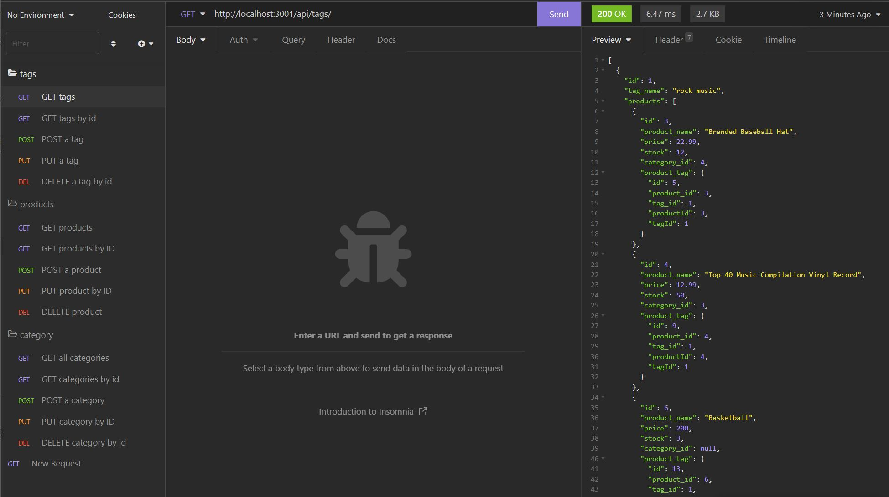

# Sequelize Ecommerce Backend 


## Description

This application uses Node.js, Sequelize and Express to build the back end of an Ecommerce backend with RESTFul APIs.

## Table of Contents

* [Installation](#installation) 
* [License](#license) 


## Installation
To install necessary dependencies, run the following command:
  ```
  User should run npm i to initiate the instillation of the package dependencies, run the update the env file with their credentials, run the schema.sql file, followed by the seeds.js file to populate the database. The server file will initiate the server on port 3001 so that the user may test their routes.
  ```

## Usage




## License
This project is licensed under the MITLicense
## Questions

If you have any questions about the repo, open an issue or contact me directly at trevorHilimire@gmail.com
This project was created by Github user: [Trv893](https://github.com/trv893/)
